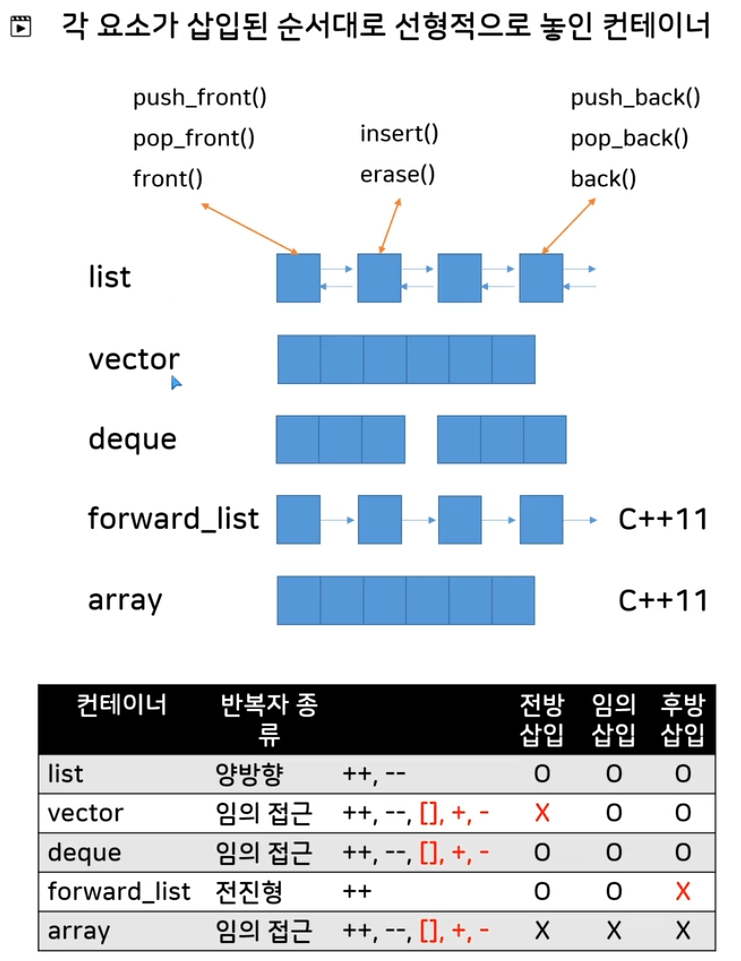
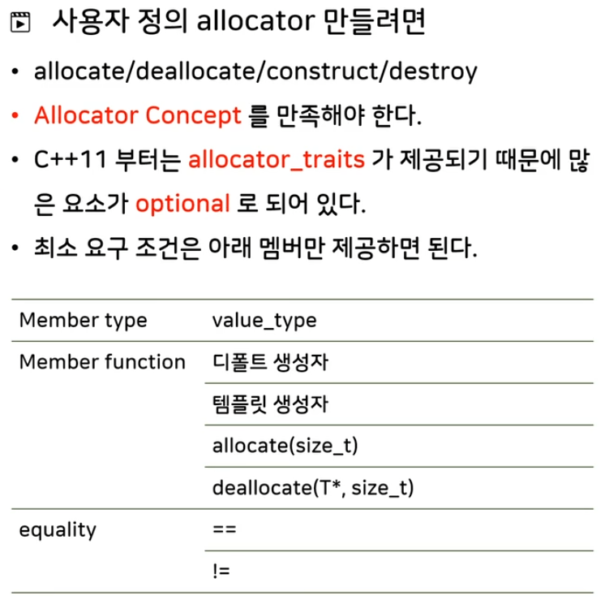
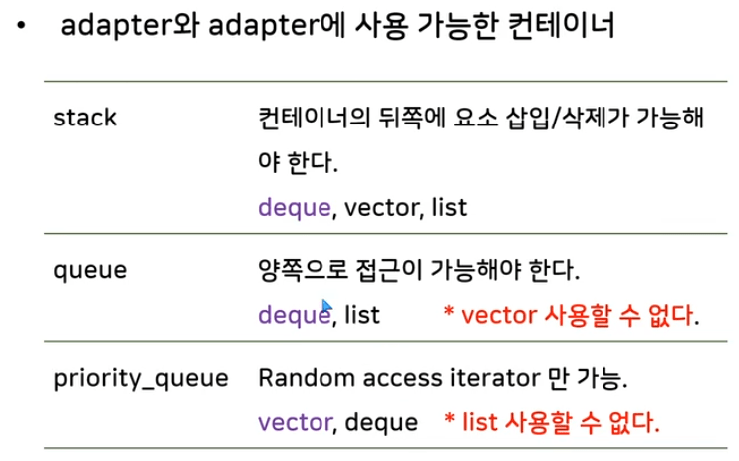
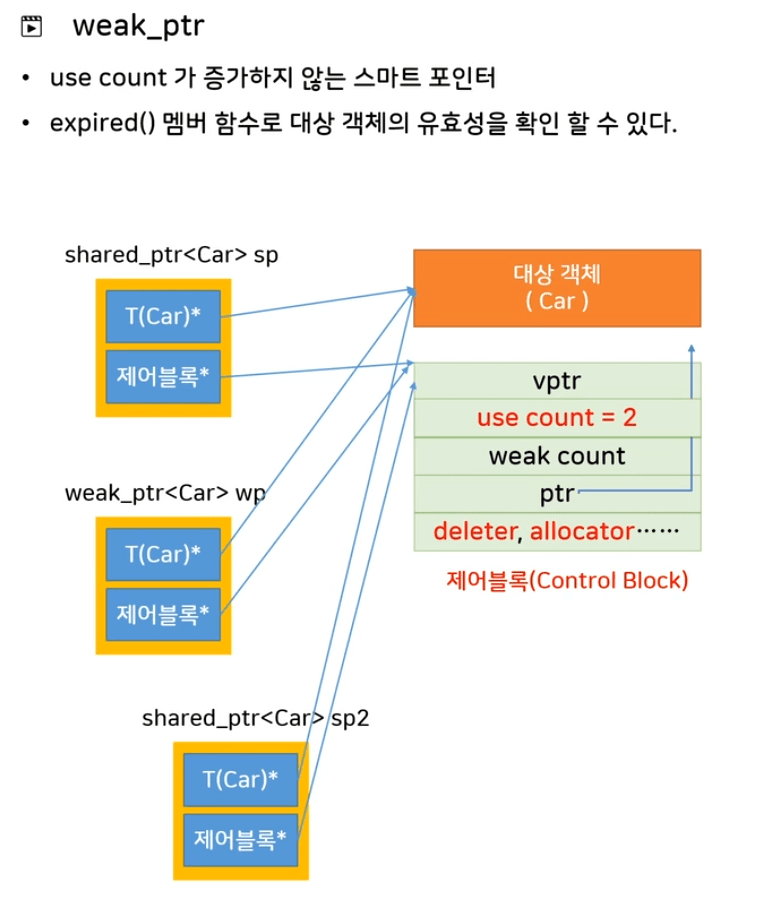
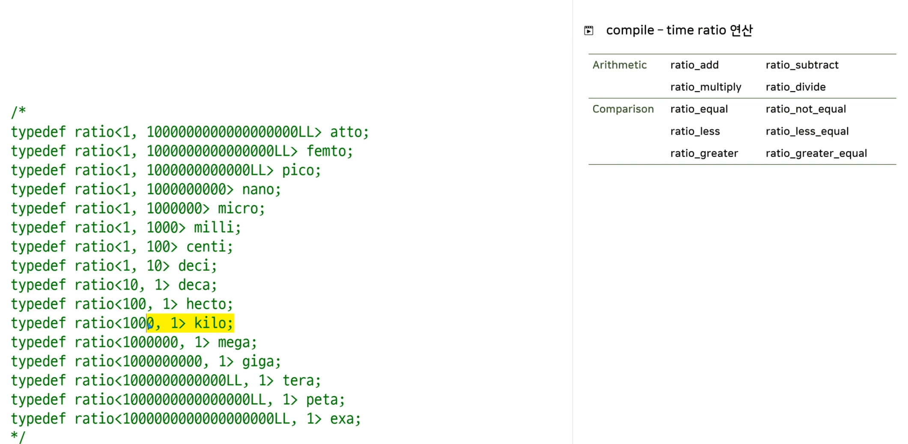
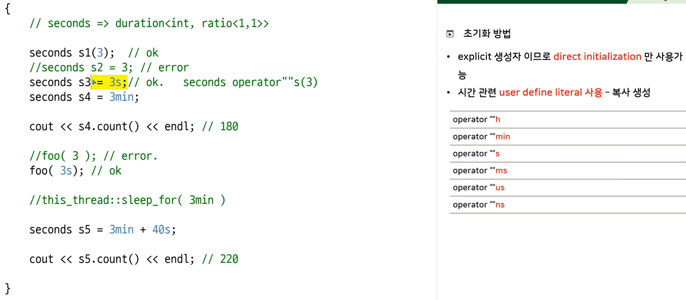

# educated-cpp-STL-Programming

## git sub module (**no use** this function in this project)
- git submodule add https://github.com/codenuri/STL.git

### get sub module when you clone git.
- git clone --recurse-submodules https://github.com/codenuri/STL.git

### When you clone git only, you run the following command.
- git submodule init
- git submodule update 
    - Then you can show the file in STL

### run it when you want to sync-up with recent remote repository.
- git submodule update --remote STL


### reference
- git submodules : https://git-scm.com/book/en/v2/Git-Tools-Submodules


# 1. STL 소개 와 STL Preview
- c++ 20 : 2020 : www.isocpp.org 참고
- http://www.cppreference.com 
- www.boost.org - c++20/23등에 추가될 라이브러리를 미리 경험
- 소스 위치 : https://github.com/codenuri/STL.git

## 1-2 : string & complex
- std::string
  - <string> 헤더
  - strcpy / strcmp() 대신 사용
  - char* c1.c_str() : const char* 을 반환
  - data() : C++11이상은 null 문자를 끝나는 것을 보장.  c_str()과 같다.
  - <string.h> <cstring>  -> C 문자열 함수를 위한 헤더 
  - stod() : string to double
  - to_string(5.4)  : string으로 변환
- literals (사용자 정의 literal)
  - foo("hello"s);   이 문자열을 string 객체로 봐 달라. <- user define literal (C++11)
  - "hello"s : string  =>  별도의 using namespace std::string_literals;   필요
  - 3s : seconds
  - 3i : complex<double>
  - 모든 literal을 다 쓰고 싶으면 : using namespace std::literals;  
- std::complex
  - 복소수를 나타내는 클래스 
  - <complex> 헤더
  - .real() .imag() member함수
  - **Literals : complex<double> 3.2i , complex<float> 3.2if , complex<long double> 3.2il 형태로 사용**
  
## 1-3 : bitset & pair
- std::bitset
  - bit를 관리하는 클래스
  - <bitset> 헤더
  - bitset<8> b1 = 0xf0;    0b11110000; 
  - 변환함수 : to_string() / to_ulong() / to_ullong()
  - set() : 모두 1로
  - reset() : 모두 0으로
  - b1[0].flip()
  - 조사 함수 : test , all , none , any , count
  - 비트 연산 가능 : `& , | , ^`
- std::pair
  - ```
    template<typename T1 , typename T2> struct pair {
      T1 first;
      T2 second;
    };
    ```
  - 서로 다른 타입의 객체를 2개를 보관하는 타입
  - <utility> 헤더   -> iostream을 쓰면 utility도 알아서 부름
  - first,second멤버를 통해서 요소를 접근
  - 함수가 2개의 값을 리턴하고 싶을때 pair로 리턴
    - (예제) set::insert 멤버 함수 
  - tuple
    - pair보다 일반화
    - 서로 다른 타입의 객체를 N개 보관
  - make_pair
    - template<typename T> void foo(T p)
    - pair<int,double> p1(1,2.1); foo(p1);
    - foo( pair<int,int>(1,1) );   여기서는 꼭 <int,int>를 꼭 적어주어야함.
    - foo( make_pair<int,int>(1,1) );  or foo( make_pair(1,1) ); 1,1을 보고 알아서 int,int로 유추
    - pair를 만드는 helper함수
    - 클래스 템플릿은 템플릿 인자를 생략할수 없기 때문에 항상 복잡하다.
    - 함수 템플릿은 템플릿 인자를 생략할수 있기 때문에 사용하기 쉽니다. 
    - c++17 부터는 클래스 템플릿도 인자를 생략할수 있다.    foo( pair(1,1) );  

# 2. STL의 설계 원리와 특징
## 2-1 : 일반화 알고르즘의 개념 : generic algorithm #1
- generic algorithm
    - find algorithm 만들기 #1 : 부분문자열도 검색이 가능하도록 개선
        - 시작 주소와 마지막 요소의 주소를 전달 : STL 이 사용하는 방식  (시작 시점 + offset도 있는데 STL은 주소,주소 방식을 사용)
        - STL은 보통 시작 주소는 검색에 포함되지만, 마지막 주소는 검색에 포함하지 않는다. 반개행구간 (half open range : [first,last) )
        - template 사용하여 일반화
        - ```template <typename T> T* efind(T* first, T* last , T value) { ... T ... } ```
        - double x[10];  efind(x,x+10,5); 에서는 5가 double이 아니므로 문제.
            - 구간의 타입과 찾는 요소의 타입이 연관되어있다. 
            - 구간의 표현은 반드시 포인터만 사용해야 한다.
        - ```template <typename T1,typename T2> T1 efind(T1 first, T1 last , T2 value) { ... T ... } ```
            - 구간의 타입과 찾는 요소의 타입을 다르게 가지면 문제 해결된다.
            - T1 , T2를 바로 사용하므로 pointer뿐만 아니라 객체도 가능.  단, ++ , * , != , == 연산이 가능해서 search가 된다. 
        - STL : 검색 실패시 NULL pointer보다는 last를 리턴.
        - C++ 표준 STL 의 find 함수 : <algorithm> 헤더
 
## 2-2 : Container & Iterator의 개념
- STL Container
    - Node의 모양 :  data , *next
- Container와 algorithm의 결합
    - 포인터가 아닌 객체를 이용하자.   efind(T1 first...)
    - ++p , *p 을 이용할수 있으면 iterator이다.
- 반복자(iterator)를 만들자
    - 내부적으로 slist안의 Node를 가리키는 멤버가 있어야 한다.  Node<T>* current=0 멤버 데이터
    - efind로 전달하려면 3가지 연산자가 재정의 되어야 한다. (4가지)
        - ++ , * , != , == 제공
        - slist_iterator& operator++()   return *this;
        - T& operator*()  return current->data;
        - bool operator ==(const slist_iterator& it) return current == it.current;
        - bool operator!=(const slist+iterator& it)  return current != it.current;
    - slist안에 자신의 시작과 마지막 다음을 가리키는 반복자를 리턴하는 멤버 함수 제공
        - begin : 처음 노드를 가리키는 iterator 리턴  return slist_iterator<T>(head);
        - end : 마지막 다음노드(0)를 가리키는 iterator 리턴 return slist_iterator<T>(0);
- class slist 안에 약속된 형태로 typedef or using으로 추가 한다. using iterator = slist_iterator<T>;
    - begin :   return iterator(head);
    - slist<int>::iterator p = s.begin();
    - 반복자의 이름을 container안에 iterator라는 이름으로 약속 : typedef or using 으로 제공
        - 컨테이너이름::iterator로 접근
- 반복자 덕분에 efind는 배열 뿐만 아니라 모든 선형 자료 구조에서 "선형 검색"을 수행할수 있다.
- STL 3대 요소
    - container / iterator / algorithm
- STL example
```cpp
    #include <list>
    #include <vector>
    reverse(s.begin()  , s.end());
    
    vector<int>::iterator p = s.begin();
    while(p != s.end()){
        cout << *p << endl;
        ++p;
    }
    
    for(auto& n: s) cout << n << endl;
    
```

- STL 컨테이너의 모든 요소를 열거하는 방법
    - [] 연산자 사용 - vector등 일부 컨테이너만 가능. list는 안됨
    - 반복자 사용 - 대부분 컨테이너 가능
    - range for문 사용   ->   for(auto& n : s)
    - 스트림 반복자 - Section 3 참조
    
# 2-3 : STL의 특징
- member type
    - 변수를 모든 container를 인수로 받자
    ```cpp
    template <typename T>
        void print(T& c){
            auto n = c.front();  // c++ 11에서는 auto로 쓰면 됨.
            //T::value_type p = c.front();   // 이렇게 value_type 이용  
                // g++ 에서는 ::value_type을 static variable로 보므로 error
                // 앞에 typename이라고 적어주어 해결
                // typename을 적으면 : value_type을 타입의 이름으로 해석 **
            typename T::value_type p = c.front();   // 이렇게 value_type 이용  
        }

    template<typename T> class list {
        public:
        typedef T value_type;  // 핵심
        using value_type = T;  // C++11
    };
        list<int>::value_type n = s.front();  // n은 int

        list<double> v = {1,2,3};
        print(v);    //v가 값이든 container든 처리 가능하게 하려면 위와 같이 선언 필요
    ```
    - STL에는 멤버 테이터와 멤버 함수 외에도 "멤버 타입"이라는 개념 제공.
        - typedef or using (C++11) 이용
    - 템플릿 의존 타입 (template dependent type)의 경우 typename을 표기해야 한다.
        - typename T::value_type
    - 템플릿이 아닌 경우는 typename을 표기하지 않는다.
        - list<int>::value_type
    - 반복자에서의 member type
        - 컨테이너가 저장하는 타입
        - 반복자가 가리키는 타입
    ```cpp
    list<int> s = {1,2,3};
    sum( s.begin() , s.end() );

    template<typename T> void sum(T first,T last){
        typename T::value_type s = 0;  // 합을 s에 보관하기 위해서  T::value_type s{}=0;으로 해주어야 좋은 코드
    }
    ```
    - value_type , size_type , iterator , iterator_category
        - `list<int>::size_type n = s.size();`

- C++17과 STL
    - list<int> s1 = {1,2,3};
    - list s1 = {1,2,3};    // C++17 style

- concept
    - std::min   <algorithm>
    - min( { 1,2,3,4,5} ) ; // ok   C++11 initialization 개념
    - min은 < 연산자를 만들어야 한다.
    - concept
        - 특정 함수 (클래스)를 사용하기 위해 타입이 가져야 하는 조건 (type requirement)
        - min함수에 전달되는 인자는 LessThanComparable 을 만족해야 한다.
        - 코드를 사용해서 concept을 정의할수 있다. - C++20부터
    - STL 템플릿이지만 "모든 타입"에 적용되는 것이 아니라 "조건을 만족"하는 타입에 대해서 동작한다.

# 3. 반복자 (Iterator)
## 3-1 : 반복자 기본
- 반복자(Iterator) in GoF's design pattern
    - provice a way to access the elements of an aggregate object sequentially without exposing its underlying representation.
    - 복합 객체의 내부 구조에 상관없이 순차적으로 요소에 접근하는 방법을 제공하는 것
- 반복자 (iterator) in STL
    - ++ 연산자로 이동가능하고 , * 연산자로 요소에 접근 가능한 것 
    - 대표적인 것은 C의 pointer (STL 에서는 포인터도 반복자)
    - directory_iterator  ++p : 다음 하위 폴더  // C++17부터 제공  :: 재미난 모양의 반복자 예제
        - using namespace std::experimental::filesystem;
        - g++ iterator1.cpp -std=c++1z -lstdc++fs
- 반복자의 다양한 형태
    - Raw Pointer
    - container의 요소를 열거위한 객체 ( begin() )
    - stream iterator
    - insert iterator
    - directory iterator ...
- contailer에서 반복자를 꺼내는 다양한 방법들
    - list<int>::iterator p = s.begin();
    - auto p1 = s.begin;    // C++11
    - int s[5]; // 진짜 배열을 썼을 경우 
        - auto p1 = begin(s);  // 이렇게 일반 함수를 사용.  배열도 가능하게 함수 overloading 해 놓음. C++11
        - int n = size(s);  empty(s)  , end(s)  // 이렇게 일반함수 사용하는게 더 일반적이됨. 
        - auto p2 = end(s); // 이때 end일때는 마지막 다음을 가리키므로 dereferencing을 하면 안된다. 끝을 아는 용도로만
- 반복자의 무효화 현상 : auto p = begin(v);  v.resize(100); 일경우에 전에 *p 을 사용할수 없음.
    - vector등의 컨테이너의 내부 버퍼가 재할당될때
    - 반복자가 가리키던 요소가 제거(erase)될때
    - 컨테이너의 종류에 따라 무효화되는 조건이 다르다.  (vector는 무효화 가능할수 있지만, list는 무효화되지 않는다.)
- 반복자의 구간 (range)
    - [first,last) 
    - 유효한 구간 : first부터 시작해서 ++연산으로 last에 도달할수 있는 구간
    - empty 구간 : fist == last 인 경우,   빈 구간도 유효한 구간이다.
- copy 알고리즘
    - copy (x , x+5 , begin(y) );  출력 for(auto& n : y) { cout << n << endl; }
    - <algorithm>

## 3-2. 반복자 카테고리 (iterator category)
- vector<int> v ...  ; sort( begin(v) , end(v) );
- list<int> v 로 하면 에러가 나온다.   // ++p , --p 가능.    //이유는 list는 sort 사용할수 없다. 
- forward_list<int> s1 ;   ++p; 문제 없지만,  --p; 는 에러
- 반복자들도 연산이 모두 다르다. 
- 반복자는 적용할수 있는 연산에 따라 5가지(C++17부터는 6가지)로 분류
    - 입력 반복자 (input iterator) : 입력 (=*i) , ++
    - 출력 반복자 (output iterator) : 출력 (*i=) , ++
    - 전진형 반복자 (forward iterator) : 입력 , ++ , multiple pass                  <forward_list>
    - 양방향 반복자 (bidirectional iterator) : 입력 , ++ , -- , multiple pass       <list>
    - 임의 접근 반복자 (random access iterator) : 입력 , ++ , -- , + , - , []       <vector> <deque>
    - 인접한 반복자 (contiguous iterator)- C++17 : 입력 , ++ , -- , + , - , [] , *(i+n) == *(addressof(*a) + n)    <vector>
- 출력 가능한 반복자 : "mutable iterator"

- multipass guarantee 개념
    - i1 == i2 일때 *i1 == *i2   &&    i1==i2일때 ++i1 == ++i2 
    - 2개 이상의 반복자가 컨테이너의 요소에 동일하게 접근함을 보장
    - list의 반복자는 multipass를 보장한다. 
    - stream / insert iterator는 multipass를 보장하지 못한다.

- 다양한 알고리즘의 인자로 요구하는 반복자 카테고리가 무엇인지 알아야 한다. 
    - auto p = find(begin(v) , end(v) , 5);  // 1,2인자 최소 요구조건 - 입력 반복자
    - reverse(begin(v) , end(v));   // 양방향
    - sort(begin(v) , end(v));      // 임의 접근 반복자 : 반으로 갈라야 한다.
        - list<int> s2는 sort(s2); // error
        - s2.sort(); // ok   quick sort가 아닌 다른 알고리즘을 사용했을 것임
        - vector<int> v;  v.sort();  // 멤버함수 sort()가 있을까?  NO  -> 일반 함수 (알고리즘) sort()를 사용하면 된다.

- tag dispatching #1 (1. 함수 인자를 사용하는 overloading)
    - list<int> s;   // 반복자 p를 5칸 전진하고 싶다.
    - advance(p,5);   
        - <iterator> 헤더
        - 반복자를 N만큼 전진(후진)하는 함수
        - 임의반복자와 그렇지 않은 경우를 분리하여 구현 하면 성능도 좋아진다. vector<int> , list<int>는 다르게 처리
    - iterator category tag
        - <iterator> 헤더
        - 반복자의 5가지 category를 나타내는 타입. empty class로 제공
        - C++17에서 추가된 contiguous iterator는 별도의 tag가 제공되지 않음.
        - using iterator_category = bidirectional_iterator_tag;
        - template<typename T>  void advance_imp(p,n,  typename T::iterator_category() ); // 객체여야 함.
- tag dispatching #2 
    - 2. is_same< , > 사용  / <type_traists>  / C++17 if constexpr 사용 (함수 1개)
        - if constexpr (is_same< T::iterator_category , random_access_terator_tag>::value) { }
    - 3. enable_if 를 사용 (SFINAE 개념 사용)  C++11  (함수 2개)
        - template <typename T>  enable_if<is_same<typename T::iterator_category,random_access_iterator_tag>::value>::type advance(T& p,intn){ }
        - template <typename T>  enable_if<! is_same<typename T::iterator_category,random_access_iterator_tag>::value>::type advance(T& p,intn){ }

- 반복자와 member type
    - 1. 반복자를 만들때 반드시 member type을 제공해야 한다. 
        - using terator_category = forward_iterator_tag;
        - using value_type = T;
        - using pointer = T*;
        - using reference = T&;
        - using difference_type = std::ptrdiff_t;
    - 2. template<typename T> class slist_iterator : public iterator< forward_iterator_tag , T> { } 
        - <iterator> 헤더
        - C++17부터는 사용되지 않음.
- 알고리즘과 category
    - template 인자들도 category 이름으로 적어주면 좋음.
    
## 3-3. 반복자 특질 (iterator traits)
- 반복자 타입::value_type
    - template <typename T> typename T::value_type  sum(T f,T s){ auto s = $f; }
    - typename T::value_type s = 0;
- 반복자는 2가지 형태
    - user define type으로 만들어진 반복자 : value_type이 있다. 
    - raw pointer (array)는 value_type이 없다.
- array일때도 해결하는 방법
    - // 핵심 : template을 사용할때는 부분특수화 가능하다.
    - template<typename T> struct iterator_traits { using value_type=typename T::value_type; }
    - template<typename T> struct iterator_traits<T*> { using value_type = T; }
    - template <typename T> typename iterator_traits<T>::value_type  sum(T f,T s){ auto s = $f; }
- value_type을 사용하는 2가지 방식
    - T::value_type
    - iterator_traits<T>::value_type   <- **Raw pointer도 해결되므로 꼭 이것을 사용하자.**

- template<class T> struct iterator_traits<T*>{ using iterator_category = random_access_iterator_tag; ... }

- auto / decltype을 사용하는 경우 
    - decltype(*first) s = 0;   // 반복자의 역참조의 type에 담겠다. error
        - decltype( *포인터타입 ) 
    - typename remove_reference<decltype(*first)::type s = 0;   // ok.
    - type deduction 규칙을 정확히 알고 사용해야 한다.

## 3-4. 삽입 반복자 (insert iterator)
- 삽입 반복자(insert iterator)
    - s.push_back(10);
    - back_insert_iterator< list<int> > p(s);   *p = 20;  // s.push_ack(20);
        - 삽입 반복자 사용하여 추가 가능 (전방 삽입 , 후방 삽입 , 임의 삽입)
    - 기본 모양
        - back_insert_iterator<컨테이너 클래스 이름> p(컨테이너 객체);
    - int x[5] = {1,2,3,4,5};   for(int i=0;i<5;i++){ s.push_back(x[i]); }
        - copy(x,x+5,p);  // p는 위의 back_insert_iterator 이다. 이렇게 한번에 push가 가능한다.
    - copy와 같은 STL 알고리즘을 사용하여 컨테이너에 요소를 추가 할수 있다.
        - 꼭 이것 아니어도 s.end()를 copy argument로 넣어주어도 될 것으로 보임.  <- 이것은 덮어 쓴 것이라고함. push_back이 아닌 덮어 쓴 것
    - template<typename T> back_insert_iterator<T>  back_inserter(T& c){ return back_insert_iterator<T>(c); }
        - copy(x , x+5 , back_inserter(s) ); // **back_inserter() c++ 11에 이미 제공**

- 삽입 반복자의 종류
    - back_insert_iterator   : back_inserter()
    - front_insert_iterator  : front_inserter()   // 1,2,3,4,5를 앞쪽에 집어 넣으면 결과는 뒤집어져있다. 
    - insert_iterator        : inserter()
- 주의 사항
    - vector는 앞에 삽입할수 없다.  (push_front 멤버 함수가 없다.)
    - 임의 삽입의 경우 생성자 인자가 2개 이다.  (컨테이너와 삽입할 위치를 나타내는 반복자)
- 전방 삽입과 임의 삽입
    - 전방 삽입을 사용해서 컨테이너에 삽입하면 요소의 순서가 반대로 삽입되지만,
    - 임의 삽입을 사용해서 컨테이너의 앞에 삽입하면 요소의 순서대로 삽입된다. 

- 동작 원리
    - C* container
    - explicit back_insert_iterator(C& c) : container(std::addressof(c)){}   // c.operator&()  &c 대신 addressof() 사용하면 좋다.  C++표준 함수
        - explicit 로 생성자 만들어 변환을 막는다. 
    - *p = 30; // (p.operator*() ).operator=(30)
        - eback_insert_iterator& operator*(){ return *this;}
        - eback_insert_iterator& operator=(const typename C::value_type& a){ container->push_back(a); return *this;}
    - copy(x,x+2,p); // ++p 로 이동하므로 ++이 있어야함.
        - eback_insert_iterator& operator++(){ return *this;}      // 전형  ++p
        - eback_insert_iterator& operator++(int){ return *this;}   // 후형  p++
    - C++11일때는 move도 만들어야 한다. 
        - eback_insert_iterator& operator=(const typename C::value_type&& a){ container->push_back(move(a)); return *this;}
    - g++에서는 copy를 만들때 내부적으로 아래 것을 사용한다.
        - using iterator_category = output_iterator_tag;
        - using value_type = void;
        - using pointer = void;
        - using reference = void;
        - using differnce_type = void;
        - using container_type = C; // **삽입 반복자는 container_type을 가져야 한다.**

- 정리
    - 모든 반복자는 *로 요소에 접근 가능하고 ++ 로 이동가능해야 한다.   no-op
    - =연산 : push_back , push_front , insert
    
## 3-5. 스트림 반복자 (stream iterator)
- ostream_iterator<int> p(cout, ", ");  *p = 20;  // cout << 20 << ", "
- copy(begin(s) , end(s) , p);
- fill_n(p , 3, 0);  // 0, 0, 0,
- 스트림 반복자
    - ostream_iterator : basic_ostream
    - ostreambuf_iterator : basic_ostreambuf    CharT 출력
    - istream_iterator : basic_istream  
    - istreambuf_iterator : basic_istreambuf  CharT 입력
- ostream_iterator 
    - * , ++ 제공해야 햔다.  대신 ++p 는 no-op
    - ofstream f("a.txt);   ostream_iterator<int> p(f,",");  *p=30;  // file로 출력이 되는 것이다.
    - 구현
        - template<typename T , typename CharT=char , typename Traits = char_traits<CharT>> class ostream_iterator
        - using iterator_category = output_iterator_tag;  value_type , pointer,reference , difference_type (일반적)
        - using char_type = CharT;
        - using traits_type = Traits;
        - using ostream_type = basic_ostream<CharT,Traits>;
        
- ostreambuf_iterator
    - ostreambuf_iterator<char> p(cout);  *p = 65;  // buf는 char만 가능함  'A'
    - 내부 동작
        - rdbuf() : stream 객체가 사용하는 streambuf의 포인터를 변환하는 stream 멤버함수
        - basic_streambuf<>::sputc() :  streambuf에 한 문자를 출력하는 함수
- istream_iterator
    - sgetc() 'x' , snextc() '\t' , snextc() 'y'
    - 디폴트 생성자는 end of stream을 나타낸다.
    - istream_iterator<char> p1(f) , p2;   ostream_iterator<char> p3;
        - copy(p1,p2,p3);  // 공백이 모두 무시됨.
    - istreambuf_iterator<char> p1(f) , p2;   ostream_iterator<char> p3;
        - copy(p1,p2,p3);  // 공백까지 모두 출력됨.

## 3-6. 반복자 어답터 (iterator adapter)
- iterator adapter
    - reverse_iterator : 거꾸로
        - auto p1=begin(s);  auto p2=end(s);
        - reverse_iterator< list<int>::iterator > p3(p2);  // p3,p4는 독립적인 객체로 움직이는 것이다. 
        - reverse_iterator< list<int>::iterator > p4(p1);
        - ++p3;  // --p2처럼
        - find(p3,p4,3);
    - 구현
        - template <typename ITER> class reverse_iterator{ ITER iter;  reverse_iterator(ITER i){ iter = i; --iter; }
        - typename ITER::value_type operator*(){ return *iter; }
        - 그외는 일반 iterator와 같이...
    - GoF의 adapter 패턴이다. 기존 것의 동작을 바꿔주는 것이다.
- reverse_iterator를 만든느 4가지 방법
    1. 기존 반복자를 가지고 생성 (adapter) : reverse_iterator<> 클래스 사용
    1. make_reverse_iterator<>  함수 사용
    1. 컨테이너에서 직접 꺼내기 : .rbegin() , .rend() 멤버 함수 
    1. rbegin(),rend()  일반 함수  : find (rbegin(s) , rend(s) , 3)
- iterator 4가지 종류
    - list<int>::iterator p1 = begin(s);
    - list<int>::reverse_iterator p2 = rbegin(s);
    - list<int>::const_iterator p3 = cbegin(s);
    - list<int>::const_reverse_iterator p4 = crbegin(s);
- <forward_list>  : single list
    - 이때는 reverse 안됨.  rbegin(s2) 안됨.
- move_iterator adapter (C++11)
    - people.h  class People
    - People peo1 = *p1;  // 복사 생성자를 부름 (copy : constructor)
    - 방법 1. move_iterator< vector<People>::interator > p2(p1);   
        - People peo2 = *p2;  // move 생성자
        - People peo3 = move(*p1);  // move 생성자  rvalue 참조를 return
    - 방법 2. auto p3 = make_move_iterator(begin(v));
    - vector<People> v2(begin(v) , end(v));  // 복사 생성자
    - vector<People> v2(make_move_iterator(begin(v)) , make_move_iterator(end(v)) );  // move 생성자
        - C++11 부터 지원됨.
    
## 3-7. 반복자 보조 함수
- iterator 보조 함수 <iterator>
    - next 
        - int* foo()  -> 진짜 pointer를 return하는 foo()에 대해서 ++foo()은 에러 
        - but   p2 = next(foo()); 는 가능
    - prev
    - advance : 반복자를 N만큼 이동
    - distance : 2개 반복차의 차이
    - iter_swap : 2개의 반복자가 가리키는 요소 교환

# 4. 알고리즘 (Algorithm)
## 4-1. STL 알고리즘의 개념.
- <algorithm> <numeric> <memory>
- 알고리즘은 컨테이너를 알지 못한다.  어떤 컨테이너의 반복자인지 알수 없다.
    - remove는 ?을 제거하고 메모리를 당기는 역할을 한다.  return 값은 다음 요소를 받게 된다. p = remove(begin(v) , end(v) , 3)
    - 지우는 것은 일반 algorithm이 아닌 멤버 함수를 사용해야 한다. v.erase(p,end(v));
- 알고리즘보다 멤버함수가 좋은 경우가 있다.
    - v.remove(3);

## 4-2. 알고리즘과 함수
- 함수 객체(function object)
    - a + b  // a.operator+(b)
    - a();   // a.operator()()
    - a(1,2)  // a.operator()(1,2)
- 함수 객체 (function objet , Functor)
    - 최초에는 "() 연산자를 재정의해서 함수 처럼 사용가능한 객체"라는 의미
    - 요즘에는 "() 연산자를 사용해서 함수처럼 호출 가능한 모든 객체" : 함수 포인터 , () 재정의한 클래스 , 멤버 함수 포인터 등...
- 함수 객체의 장점
    - 알고리즘에 전달시 일반 함수는 인라인 치환이 안되니만 , 함수 객체는 인라인 치환 가능
    - 상태를 가질수 있다.
```cpp
#include <iostream>
using namespace std;
// ()를 사용해서 호출하는 것들
// 1. 함수
// 2. 함수 포인터
// 3. ()를 재정의한 클래스
// 4. 람다표현식...
Struct Plus {
    int operator()(int a, int b) const { return a+b; }
};

Plus p;
int n = p(1,2);
```

- #include <functional>   <- 여기 plus 같은 함수들이 template으로 정의되어져있다.
    - plus<int> p; p(1,2);
    - multiplies<int> m;  m(3,4);

- 알고리즘과 함수
    - for_each (begin(v) , end(v) , foo);
    - STL 알고리즘은 함수를 인자로 가지는 경우가 많이 있다.
        - 알고리즘의 활용도가 더욱 높여준다.
        - for_each , transform
        - for_each는 인자가 1개
    - 일반 함수 뿐 아니라, 함수 객체 , 람다 표현식을 사용할수 있다. - ()로 호출가능한 모든 객체를 사용 가능
        - Show s(cout, "\t");  for_each (begin(v),end(v) , s); 와 같이 함수 객체를 넘길수도 있다. Show는 operator()(int a)의 생성자가 있다.
- 람다 표현식
    - for_each 
        - 일반 함수 전달 : for_each (begin(v) , end(v) , foo);
        - 함수 객체 전달 : for_each (begin(v) , end(v) , s);
        - C++11 : 람다표현식 : for_each (begin(v) , end(v) , [](int a){cout << a << endl; }  );
            - []을 lambda introducer 라 부른다.
- transform 
    - 인자로 전달된 컨테이너의 모든요소에 연산을 적용후 다른 컨테이너에 복사하는 알고르즘
        - transform(begin(s1) , end(s1) , begin(s2) , foo) ;  s1 시작 ~ 끝까지는 foo에 인자로 넣어 s2에 return값을 넣는다.
    - 알고리즘이 2개의 구간을 받을때는 첫번째 구간은 양쪽을 받고 , 2번째 구간은 처음만 받는다. (유추가 가능하다고 한다.)
        - transform(begin(s1) , end(s1) , back_inserter(s2) , foo) ;  // s2 container가 empty일때도 죽지 않는다. 
    - 이항 함수 버젼
        - transform(begin(s1) , end(s1) , begin(s2) , begin(s3) , foo) ; // s1의 모든 내용을 s2와 함께 차례로 foo에 보내서 foo(1,2) 을 하고 결과를 s3에 넣는다.
        - transform(begin(s1) , end(s1) , begin(s2) , begin(s3) , multiplies<int>() ) ;
        - transform(begin(s1) , end(s1) , begin(s2) , begin(s3) , [](int a , int b){ return a+b; } ) ;

## 4-3. 알고리즘의 변형
- 조건자 (Predicator)
    - bool 타입을 리턴하는 함수 (함수 객체)
    - find_if(begin(v) , end(v) , 함수);   bool 함수(int a) 가 true를 return하는 첫번째 요소를 찾아라.
    - find_if(begin(v) , end(v) , [](int a){ return a%3 == 0;  } );
- 알고리즘의 4가지 형태
    - 기본 버젼 : remove_if(begin(v) , end(v) , 3);
    - 조건자 버젼 : remove_if(begin(v) , end(v) , [](int a){ return a%3 == 0; });
    - 복사 버젼. remove_copy(begin(v) , end(v) , begin(v2) , 3);   // 리턴 값 p는 v2의 반복자
    - 조건자 복사 버젼 : p = remove_copy_if(begin(v) , end(v) , begin(v2) , [](int a){ return a%3 == 0; });  v2.erase(p,end(v2)); // 3의 배수는 모두 제거 및 뒤의 0을 없앤다. 
- sort  : STL 설계 철학
    - 인자 2개는 default , 인자 3개는 뒤에 함수가 나온다.  뒤에 _if 를 안 붙여도 된다.
    - sort_copy( begin(v1) , end(v1) , begin(v2));  // 이 함수가 존재하는가?  STL에는 존재하지 않는다. 하나로 합쳐봤자 큰 성능 향상이 없다. 
        - remove_copy : copy 후에 remove하는 것보다 동시에 하는 것이 빠르다. (한번에 하면 성능향상이 된다.)
        - copy후에 sort하면 된다.  동시에 해도 성능 향상이 크지 않다.
- std::bind
    - modulus<int> m;   n = m(10,3);  // 10%3 => 1
    - find_if(x,x+5, 함수);   // 이미 함수가 있다면 재사용
        - find_if(x,x+5, m); // error , find_if는 단항함수 인데 modulus는 이항 함수
        - 이항을 단항으로 바꾸면 넘길수 있다.   --> bind
    - void foo(int a, int b , int c , int d)
        - foo(1,2,3,4); // 4항 함수
        - 2항으로 변경     bind(&foo, 10 , _2 , _1 , 20)(1,2)   // _2 뒤의 2번째 인자를 사용
            - // bind의 return값으로 나오는 것이 함수 객체
    - M항 함수 (함수객체)의 인자를 고정한 새로운 함수를 생성
    - C++11
    - <functional>
    - placeholder(_1,_2...)는 std::placeholders 이름 공간에는 있다.
        - // 4gkd gkatn => 3 항으로
        - bind(&foo , _3, _2, _1 , 100)(30,20,10);
        - bind(&foo,1,2,3,4)();
    - modulus<int> m ;  bind(m, 10 , 3)();
    - modulus<int> m ;  bind(m, _1 , 3)(7);
    - modulus<int> m ;  find_if(x, x+5, bind(m, _1 , 3) );

# 5. 컨테이너
## 5-1. STL Container의 특징
- container 종류
    - sequence container
        - 요소가 삽입된 순서대로 놓여있는 컨테이너
        - C++98 : list , vector , deque
        - C++11 : forward_list_array
    - associative container
        - 삽입된 순서와 상관없이 규칙을 가지고 요소를 보관
        - C++98 : tree -> set, multi-set , map , multi-map
        - C++11 : hash -> unordered_map , unordered_multimap
    - container adapter
        - stack , queue , priority_queue

- 공통적 특징
    - 값을 보관한다.
        - 복사본을 보관한다.
    - 멤버 함수 뿐 아니라 "Member Type"이 있다. 
        - ::value_type   
        - ::interator
    - 반복자를 가지고 있다. 
        - s.begin()
        - begin(s) <- it's better
    - 제거와 리턴을 동시에 하지 않는다.
        - s.back()을 하여 마지막을 출력하고 , 제거는 s.pop_back()을 추가적으로 해야 한다.
    - STL 자체는 예외가 거의 없다.
- 단위 전략 디자인  (Policy Base Design) 과 STL
    - STL은 내부적으로 어떻게 메모리 할당을 할까?  new , malloc , 공유 메모리 , pool , system call 등...
    - 사용자가 원하는 방식으로 바꿀수 있게 해준다. template인자로 Allocator를 받는다.
    - Allocator
        - 메모리 할당 정책을 담은 클래스 : allocate() , deallocate()
        - 표준 할당기 typename Allocator = allocator<T>
    - vector<int, MyAlloc> v; 로 자신의 것을 변경할수 있다. 
    - 단위 전략 디자인 
        - 클래스가 사용하는 다양한 정책을 "템플릿 인자"를 통해서 교체할수 있게 하는 디자인 기법
    - string class
        - using string = basic_string<char>; 
        - using wstring = basic_string<wchat_t>;
        - template < typename T , typename Traits = std::char_traits<T> , typename Allocator = std::allocator<T> > 
            - 2번째는 비교 정책 클래스
            - 대체하려면 char_traits 의 모든 member함수를 구현해야 한다.  cppreference.com
            - 다 구현이 힘들면 calss mytraits : public char_traits<char> {} 로 선언하면 된다.  이중에 변경할 것만 만들면 된다.
- 
## 5-2. Sequence Container 1
- list
- vector
    - vector<int> v7(10,0); // 10개의 0으로 초기화
    - vector<int> v8{10,0}; // 2개의 10,0으로 초기화
    - v.push_back(10);  // v.push_front(10) 은 에러
    - v.insert(begin(v) +1 , 30);
    - v.front;
    - v[0]
    - v.assign(x,x+5);  
    - sort(begin(v) , end(v)) ;   // 이것과 같이 대부분은 algorithm에서 처리
    - v[100] = 10 ; // 예외 없이 runtime error
        - v.at(100) = 10;  // 예외 발생  (성능이 떨어짐)
    - 크기
        - v.resize(7); // 10개를 7개로 줄임 ->  v.capacity() 10 이며 , v.size()만 7로
        - v.shrink_to_fit(); // 쓸데 없는 메모리 삭제
    - 
- deque
- forward_list (C++11)
- array (C++11)

- vector #2
    - replace(begin(v[i]), end(v[i]), 'i' , ' ')  // 공백으로 치환
    - replace_if(begin(v[i]), end(v[i]), [](char c){ return c == 'a'; } , ' ')  // lambda
    - ```cpp
        struct FindChar {
            string data;
            FindChar(string s) : data(s) {}
            bool operator() (char c) const {
                auto p = find (begin(data) , end(data) , c);
                return p != end(data);
            }
        }
        
        FindChar fc("aieouAIEOU");   
        replace_if(begin(v[i]), end(v[i]), fc , ' ')  // 함수 객체
        ```

- array
    - vector는 heap에 잡음. 
    - array는 stack에 잡음. 
    - array<int , 5> arr = {1,2,3,4,5};
    - arr.size()
    - C++11
    - 전방삽입 , 후방삽입 , 임의 삽입 불가
    - raw pointer vs 객체형 반복자
        - 반복자를 만들때 raw pointer보다는 객체형 으로 만드는 것이 좋다. 
        - raw pointer 값으로 리턴하면 ++를 사용할수 없다.
        - 객체형 반복자는 ++ 연산을 사용할수 있다.
        - raw pointer도 next() 알고리즘을 사용하면 다음으로 이동할수 있다.   next(arr.gegin())
        - 실제 STL code는 객체형으로 만들어져있음.

## 5-3. Sequence Container 2
- container와 사용자 정의 타입
    - vector<Point> v2(10); 하면 Point가 default 생성자가 없으면 에러가 난다.
        - vector<Point> v2(10, Point(0,0)); 하면 해결됨
        - 사용자 정의 타입을 컨테이너에 넣을때 , 디폴트 사용자가 없을경우 복사 생성을 위한 객체를 전달해야 한다.
    - sort (begin(v2) , end(v2)); // compare가 없어서 에러
        - sort (begin(v2) , end(v2), [](const Point& p1,const Point& p2){ return p1.x > p2.x; });
        - operator<  operator== 을 제공
    - using namespace std::rel_ops;   // relation operators
        - p1 != p2; 같은 것을 쓸수 있다. 
        - > , != , <= , >= 의 일반화 버젼을 제공 (But , == , > 은 만들어주어야 한다.)
        - == > operator를 만들때는 상수 함수로 만들어야 한다. const 꼭 붙여야 한다.
- 컨테이너에 객체를 넣는 방법
    - 1. v.push_back(p1);
    - 2. 임시객체 넣기 : v.push_back(Poitn(10,20));  // 객체가 조금 더 빨리 파괴
    - 3. 객체 자체를 vector가 만들게 한다. : ** v.emplace_back( 10,20); **
        - 객체를 전달하지 말고 , 생성자 인자를 전달한다. 
    - 4. v.push_back (move(p1));
- allocator
    - Point *p = new Point[2];
    - std::allocator
    - allocator<Point> a;   Point* p = a.allocator(1);  // operator new()
    - a.constructor(p); 
    - a.destroy(p); // 소멸자 호출
    - a.deallocate (p,1);
    - 직접 만들기
        - C++11부터는 optional 이라는게 뭍는다. 
        - 
        - MyAlloc<Point> a;
        - allocator_traits<decltype(a)::construct(a,p,1,2);  // a에 construct 함수가 있으면 그것을 실행 , 없으면 p(1,2) 수행 
        - allocator_traits<decltype(a)::destroy(a,p);
        
## 5-4. container adapter
- 개념 (constainer adapter)
    - adapter 디자인 패턴
        - 클래스의 인터페이스를 변경해서 **새로운 클래스** 처럼 보이게 만드는 디자인 패턴
    - list로 할건지 , vector로 할건지를 정해서 사용할수 있게 변경해주면 좋을 듯
        - template<typename T , typename C=deque<T> > class Stack {  C st;  ... }
        - Stack<int,vector<int>> s;
    - <stack>  <- stack adapter
- STL container adapter
    - 3가지의 container adapter가 제공된다.
        - <stack> : stack
        - <queue> : queue , priority_queue
    - queue<int,vector<int>> q2;  // error가 나와야 하지만 , 에러 없이 compile이 된다.
        - 함수만을 만들었을 뿐인 compile때는 에러가 안 나온다.
        - 그러나, 실제로 호출할때 에러가 나야 한다. 
        - template에서 lazy instance 때문에 실제로 사용될때 error가 나온다.
    - 
- priority_queue
    - <queue>
    - 요소를 꺼낼때 삽입한 순서에 상관없이 우선순위가 가장 높은 요소가 먼저 나온다.
    - <  을 비교 연산자로 사용한다.
        - <functional>
        - priority_queue<int , vector<int> greater<int> > pq;
    - 우선 순위를 변경하려면 템플릿 인자로 객체를 전달한다.
        - 절대값으로 비교원할시
        - ```cpp
            struct abs_greater {
                bool operator()(int a , int b) const {
                    return abs(a) > abs(b);
                }
            };
            ```
            
## 5-5. associative container
- set
    - std::set  // RB tree
    - C++ 표준은 세부 구현을 정의하지 않는다.
        - set을 구현하기 위해 어떤 자료구조를 사용해도 상관없다. 하지만, 대부분이 RB tree를 사용한다. 
    - <  연산으로 비교
    - template< class Key, class Compare=std::less<Key> , class Allocator=std::allocator<Key> > class set;
        - set<int , greater<int>> s;
    - 요소 삽입
        - insert / emplace로만 요소를 삽입할수 있다. 
        - **반복자를 통해서 값을 변경할 수 없다.**  p=begin(s);  *p=10 // error
    - auto p2 = s.find(10); 으로 찾아야 빠르다. 
        - find(begin(s),end(s),10); 으로도 가능하지만 root부터 찾으므로 느리다.
    - auto ret = s.insert(20);  // <iterator , false> 로 return값이 반환됨.
        - if(ret.second == false) cout << "fail" << endl;
        - pair<set<int>::interator , bool> return type
    - multiset<int> s ;   // 중복 허용
        - multiset<int>::iterator 가 return 값  (실패가 없기 때문에)
    - 사용자 정의 type을 set에 넣는 것
        - s.insert(Point(1,1));   // < 연산자 필요
        - 1. 사용자 정의 타입 안에 < 연산을 제공하거나
        - 2. 사용자 정의 타입에 대해 < 연산을 수행하는 함수 객체를 set의 2번째 템플릿 인자로 전달한다.
            - struct PointLess { bool operator()(const Point& p1 , const Point& p2){ ... }  };
            - set<Point , PointLess> s;
        - 3. set에서는 left , right 가 아니면 같다고 보기에 ==operator가 필요하지 않다.
    - s.emplace(1,3);  // 조금더 성능이 좋다.
- map
    - pair를 저장하는 set
    - key(first) 값으로 data(second) 를 저장
    - map<stirng,string> m;
    - data입력
        - 1. pair 만들어 insert : pair<string,string> p1("mon","1");
        - 2. make_pair  : m.insert(make_pair("tue","2"));
        - 3. m["wed"] = "3";
    - 없는 요소를 찾을때 m["Sat"]  와 같이 찾으면 새롭게 생성
        - key가 없을 경우 , **새롭게 생성된다.**
        - ret = m.find("sun");  if (ret == m.end()) 로 처리해야 key 가 없는 것을 확인할수 있다. 
    - map의 반복자
        - 반복자 : 요소를 가리키는 포인터 역할의 객체
        - pair를 가리키는 포인터
- C++ 표준 stream
    - <sstream> : 메모리 (string) 입출력 
    - string s;   cin >> s; // 표준 입력에서 한 단어
    - ifstream fin("stream.cpp");   fin >> s;  // 파일에서 한 단어
    - istringstream iss("I am a boy");   while(iss >> s) cout << s << endl;
    - cout << "hello";   // 화면 출력
    - ofstream f("a.txt");  f << "hello";  // 파일 출력
    - **ostringstream oss;**  oss << "hello";  // oss의 버퍼에 출력  
        - oss.str()
        - char buf[10];  sprintf(buf,"n=%d",n);  이라고 쓰는 대신
        - ostringstream oss2;  oss2 << "n = " << n ;  // 사이즈 상관없이 안전하게 문자열을 만들수 있다.
    - 파일에서 단어 분석하기 (각 단어가 몇번째 줄에 나오는지)
        - ```cpp
            <iostream> <fstream> <sstream> <map>
            map<string, list<int>> index;   // list대신 set을 쓰는게 더 좋을 듯 한데...
            ifstream f("text.txt");
            int lineno = 0;
            string s;
            while(getline(f,s)) // 파일에서 한줄씩 읽기
            {
                lineno++;
                istringstream iss(s);
                string word;
                while(iss >> word){
                    index[word].push_back(lineno);
                }
            }
            
            auto p = begin(index);
            while(p != end(index)){
                cout << p->first << ":" ; // 단어 출력
                for (auto n : p->second) cout << n << " , ";
                cout << endl;
                ++p;
            }
            ```
            
- unordered_set , unordered_map
    - C++11
    - hash table 기반의 자료 구조
    - <functional>
    - hash function : hash라는 이름의 functor로 제공
        - hash<int> hi;  hi(50);
- unordered_set
    - hash table을 사용하는 set
    - 정렬 상태를 유지하지 않는다.
    - set : < 사용 , unordered : hash 사용
    - template< class Key , class Hash = std::hash<Key> , class KeyEqual=std::equal_to<Key> , class Allocator = std::allocator<Key> > class unordered_set;
        - 사용자 타입에 대한 hash 함수 (Functor)가 필요하다.
        - 사용자 타입에 대한 equality 를 조사하는 Functor가 필요
        

# 6. 유틸리티 (utility)
## 6-1. Smart Pointer #1
- 개념
    - 포인터와 유사하게 동작하는 추상화된 타입으로 포인터의 기능외에 자동화된 자원 관리등의 기능을 추가로 제공한다.
    - shared_ptr<Car> p(new Car);   // include <memory>  : 객체이므로 끝날때 소멸자가 불려진다. 
    - Car* p ; // 진짜 포인터
    - raw pointer : 생성자 , 소멸자등을 가질수 있다.
    - smart pointer : 생성자 , 소멸자등을 가진다.  생성 / 복사 / 대입 / 소멸 의 과정에 추가적인 기능을 수행할수 있다. 일바적으로 소멸자에서 자동화한 자원 관리를 수행한다.
- 원리
    - shared_ptr<Car> p(new Car);  p->Go(); // p.operator->()
    - 소멸자에서 자원을 삭제 한다
- c++ 표준 스마트 포인터 
    - shared_ptr<>  , weak_ptr<> , unique_ptr<>
- shared_ptr
    - <memory> header
    - int a = 0;  // copy initialization
    - int a(0);   // direct initialization
    - shared_ptr<Car> p = new Car;  // error : 복사 초기화 허용 안함
    - shared_ptr<Car> p(new Car);   // ok
    - copy초기화 될수 없고 , direct 초기화만 가능한다. - explicit 생성자
        - explicit키워드는 이런 상황에서 사용합니다. 자동 형 변환을 의도하지 않은 사용법인 경우, 버그를 야기할 수도 있기 때문에 explicit키워드를 써서 컴파일러가 파라미터 형 변환을 위해 생성자를 호출하는 것을 막아 버그를 방지할 수 있습니다.
    - shared_ptr<Car> p2 = p1;
        - shared_ptr 생성시 , 참조 계수 등을 관리하는 제어 블럭이 생성된다. 
        - 자원을 공유(share)하는 스마트 포인터
    - 삭제가 변경
        - shared_ptr<Car> p(new Car , foo); 
        - shared_ptr<> 생성자의 2번째 인자로 삭제자 전달
            - 함수 , 함수 객체 , 람다 표현식 가능
        - foo 수행되고 , ~Car)() 수행됨
    - 할당자 변경
        - 3번째 인자 
        - 제어블럭을만들고 파괴할때 할당자 사용
        - shared_ptr<Car> p(new Car , [](Car* p){ delete p; }  , MyAlloc<Car>() )
        - 수행 | c++filt   쓰면 demangling 시켜준다.
    - shared_ptr과 배열 - until C++17
        - 삭제자를 변경해야 한다. 
        - [] 연산 제공하지 않음. 
        - shared_ptr을 사용해서 배열을 관리하는 것은 권장하지 않는다. - vector , array 사용 권장
        - C++17 이후
            - shared_ptr<Car> p1(new Car[10]);   // error - delete[] , [] 연산 없음. 
            - shared_ptr<Car[]> p1(new Car[10]);  // delete[] , [] 연산 있음.
- shared_ptr의 다양한 현상들
    - shared_ptr<Car> p1(new Car);
    - p1->Go() ; // Car의 멤버 접근
    - p1.   // shared_ptr 주요 멤버 함수 
        - 대상체의 포인터 변환 Car* p = p1.get();
        - 참조계수 반환 p1.usee_count();
        - 대상체 변경 p1.reset( new Car );
        - 대상체 교환 p1.swap(p2);
- make_shared
    - shared_ptr<Car> p1(new Car);  에서 동적 메모리 할당이 몇번 일어나는가? 
        - void* operator new(size_t sz){} 재정의 가능
        - 2번 할당됨을 볼수 있다. 
    - 2번 할당되는 것을 1번만 할당하는 것으로 변경하기 위해서 make_shared<Car>(); 을 사용
        - 메모리 할당이 효과적이다. 
    - shared_ptr<Car> p1 = make_shared<Car>(); // ok
    - shared_ptr<Car> p1 (make_shared<Car>()); // ok
    - 예외 상황에 좀 더 안전하다. 
        - f( shared_ptr<Car>(new Car), foo() ); f의 호출시 3가지 일이 발생한다.
            - 예로 Car를 할당하고, foo 를 쓰고 , shared_ptr를 만들때 , foo를 하다가 예외가 발생하면 메모리 문제가 발생할수 있다.
        - f (make_shared<Car>() , foo() ); 으로 하면 make_shared()를 한번에 수행하므로 안전
    - shared_ptr<Car> p1 = allocate_shared<Car>(MyAlloc<Car>())
        - 메모리 할당/해지 방식을 변경하려면 allocate_shared를 사용한다. 
- shared_ptr 사용시 주의 할점
    - raw pointer를 사용해서 2개 이상의 shared_ptr를 생성하면 안된다.
        - shared_ptr<Car> sp1(p);  shared_ptr<Car> sp2(p); 를 하면 문제가 발생한다.   // error
        - shared_ptr<Car> sp3(new Car); // RAII (resource acquition is initialize)  : shared_ptr 만들때 new를 해라.   ok
        - shared_ptr<Car> sp3 = make_shared<Car>();  // better
- enable_shared_from_this : shared_ptr 사용시 this로 부터 관리 객체를 공유 할수 있게 하기 위해서 사용하는 기반 클래스
    - thread Worker 객체의 수명 
        - 주 스레드의 sp1도 사용하지 않고 , 새로운 스레드도 종료 되었을대 파괴되어야 한다.
        - Worker객체가 자기 자신의 참조 계수를 증가해야 한다.
        - class Worker : public enable_shared_from_this<Worker>      // CRTP : 자기 이름을 인자로 또 넣어주는 경우 
        - shared_from_this() 함수 사용하여 내부적으로 shared_ptr<Worker> holdme; 로 잡을수 있다.
            - holdme = shared_from_this();
        - shared_from_this()를 호출하기 전에 반드시 제어 블럭이 생성되어 있어야 한다.
        - thread 종료 되었을때 , holdme.reset(); 을 하면 thread가 다 처리된후에 파괴된다.

## 6-2. smart pointer #2
- shared_ptr 의 상호 참조 문제
    - 이런 경우 자동으로 delete가 안된다. 
        - shared<People> p1(new People("kim"));
        - shared<People> p2(new People("lee"));
        - p1->bf = p2;    // shared_ptr<People> bf;
        - p2->bf = p1;
    - 내부적인 포인터들은 참조계수가 증가하면 안된다. 
        - 참조 계수가 증가하지 않는 포인터 : raw pointer
            - People *bf;    p1->bf = p2.get();  p2->bf = p1.get();
        - p2가 먼저 파괴될때 , p1에서의 bf를 보고 뭔가를 하면 error
        - 단점 : 대상 객체가 파괴되었는지 알수 없다.  -> 해결책 : weak_ptr
- weak_ptr  (상호 참조시는 weak_ptr 사용)
    - weak_ptr<Car> wp;    // use count 증가 안함.
    - wp.expired()  == true이면 destroy가 된 것이다. 
    - ```cpp
        weak_ptr<Car> wp;
        {
            shared_ptr<Car> sp(new Car);
            wp = sp;
        }
        if (wp.expired() ) cout << "destroy" << endl;
        else {
            cout << "not destroy" << endl;
            // weak_ptr을 사용해서는 대상객체를 접근할수 없다.
            wp->Go(); //error
            
            // weak_ptr을 가지고 다시 shared_ptr을 만들어야 한다.
            shared_ptr<Car> sp2 = wp.lock();
            if(sp2) sp2->Go();    // sp2가 유효한지도 한번더 check해야 한다.
        }
        ```
    - 
    - ```cpp
        class People { ...
            weak_ptr<People> bf;
            void Go() {}
        };
        
        shared_ptr<People> p1 (new People("K"));
        { 
            shared_ptr<People> p2(new People("T"));
            p1->bf = p2;
            p2->bf = p1;
        }
        // bf의 Go를 호출하고 싶으면 
        shared_ptr<People> sp2 = p1->bf.lock();
        if(sp2) sp2->Go();
        ```
    - use_count == 0 일때 대상 객체는 파괴되지만 제어 블록은 use_count , weak_count가 모두 0일때 파괴된다. 
    - 제어블럭에 vptr (가상 함수) 들도 들어가 있다. 

- unique_ptr
    - unique_ptr<Car> up1(new Car); // 자원 독점
    - unique_ptr<Car> up2 = up1;  // error
    - 기본적으로 raw pointer와 동일한 크기를 가진다. 단 삭제자 변경시 크기가 커질수 있다.
    - 복사 될수 없지만 , 이동은 될 수 있다.
        - unique_ptr<Car> up2 = move(up1);  // ok. 
    - 삭제자 변경
        - 템플릿 인자와 생성자를 사용해서 전달
        - 1. 함수 객체 사용
            - unique_ptr<int , Deleter> up(new int);  // 함수 객체 
            - struct Deleter { void operator()(int *p) const { delete p; } }
        - 2. 람다 표현식 사용
            - auto f = [](int*p){delete p; }   unique_ptr<int , decltype(f)> up(new int,f);  
        - 3. 함수 포인터 사용
            - unique_ptr<int , void(*)(int*)> up(new int,foo);  
    - 배열
        - unique_ptr<int[]> up(new int[10]);  // c++11
- shared_ptr 과 unique_ptr
    - shared_ptr<int> sp1 = up ; // error
    - shared_ptr<int> sp2 = move(up); // ok
    - unique_ptr<int> up1 = sp; // error
    - unique_ptr<int> up2 = move(sp); // error
    - 함수 return type을 unique_ptr<> 로 return하는 것이 좋다. 
        - 이유는 unique_ptr , shared_ptr 어떤 것으로 선언해도 받을수 있다. 
        
## 6-3. Chrono
- ratio template
    - 컴파일 시간 분수 값을 나타내는 템플릿
    - <ratio>
    - 2개의 static member data로 구성된다. 
        - num : 분자 (numerator)를 타나내는 컴파일 시간 상수
        - den : 분모(denominator)를 나타내는 컴파일 시간 상수
    - 분자 , 분모는 컴파일 시간 연산을 통해서 약분된 상태로 저장된다.
    - ration 자체가 실행 시간에 메모리에 보관하는 값은 없고 , 오직 컴파일 시간에 사용되는 상수 값이다. 
    - ratio<2,4>::num // 1
    - ratio<2,4>::den // 2
- compile time ratio 연산
    - ratio_add<분수 , 분수> r2;
        - ratio_add< ratio<1,4> , ratio<2,4> > r2;   // 3/4
    - 
- duration
    - duration < double , ratio<1,1> > d1 = 3;  // 3m
    - duration <double , ratio<1,1000> > d2 (d1);  // milli 3000
    - cout << d2.cout() << endl;  // 3000
    - duration <double , ratio<1000,1>> d3 (d1);  // km
    - cout << d3.count() << endl;  // 0.003
    - <chrono> 헤더
    - namespace chrono;
    - ratio 로 표현되는 단위(주기)에 대한 값을 보관하는 클래스 
    - 오직 하나의 값만을 보관한다. 
    - duration을 사용하면 단위에 맞게 자동으로 연상이 수행된다.
    - using MilliMeter = duration<double,milli>;
- duration with int 
    - KiloMeter km = duration_cast<KiloMeter>(m);  // 버림.
    - 큰 단위로 옮길때 int일 경우 data손실이 발생하므로 , 그냥 쓰면 error이지만, cast를 하면 버림 , 반올림등으로 처리 가능하다.
- chrono (시간)
    - C++표준에 시간 관련 타입 정의 됨 
    - 작은 type이 큰 type에 들어갈때는 duration_cast 필요
    - using days = duration <int , ratio<3600 * 24 , 1>>;  // 없으면 이렇게 만들면 된다.
    - 초기화 방법 : explicit 생성자 이므로 direct initialization 만 사용가능
        - seconds s1(3); // ok
        - seconds s2 = 3 ; // error
        - seconds s3 = 3s; // ok .  seconds operator""s(3) 복사 생성자
        - void foo(seconds s){}    
            - foo(3s); // ok   
            - foo(3);  //error
        - this_thread::slepp_for(3s); 
    - 시간 관련된 user define literal 사용 - 복사 생성
        - 
    - 시간 구하기
        - time_point
            - 기간의 시작과 경과 개수를 나타내는 타입
            - epoch time : 1970년 1월 1일 0시를 기점으로 경과된 시간단위
        - system_clock::time_point tp = system_clock::now();
        - nanoseconds ns = tp.time_since_epoch();
        - cout << ns.count() << endl;
        - hours h = duration_cast<hours>(ns);  cout << h.count() << endl;
        - 문자열 변환
            - time_t t = system_clock::to_time_t(tp);
            - string s = ctime(&t);  cout << s << endl;

## 6-4. function & bind
- bind
    - 함수의 인자를 고정한 새로운 함수를 만들때 사용
    - <functional>
    - namespace std::placeholders;
    - placeholders: _1 , _2, _3 ...
    - bind(&f1,1,2,_1)(10);     // f1(1,2,10);
    - void f2(int& a) { a = 20; }
        - int n=0;
        - bind(&f2,n)(); // f2(n)
        - cout << n << endl;   // 0 이 나옴.   인자를 고정할때 값 방식으로 고정한다. 
        - C++의 참조를 흉내내서 쓴다. 
            - bind (&f2 , ref(n))();  // 20   // cref는 const 참조로 고정해 달라. 
                - reference_wrapper<int> r(n);
                - bind(&f2,r)();  // 이러면 20이 나온다. 
    - ref()  : 참조 바인딩
- member 함수/데이터 의 bind
    - class Test {   void f(int a, int b){ } };
    - 모든 종류의 callable object에 사용가능
    - Test t;  bind(&Test::f, &t , 1,2)();  // t.f(1,2)
    - Test t;  bind(&Test::f, t , 1,2)();  // t.f(1,2)  <- 이것은 복사본을 가지고있는 것이다. 
    - Test t;  bind(&Test::f, ref(t) , 1,2)();  // t.f(1,2) 
    - Test t;  bind(&Test::f, 1,2)(t);
    - Test t;  bind(&Test::f, 1,2)(&t);
    - bind(&Test::data, &t)() = 10;  // t.data = 10   setter를 만든 것과 같다.
- function
    - void f1(int a)
    - void f2(int a,int b, int c)
    - <functional>
    - 함수 포인터를 일반화 한 개념
    - callable object를 보관했다가 나중에 호출할때 사용
    - 함수 signature가 다른 경우 bind()와 함께 사용
    - ```cpp
        function<void(int)> f;   // 인자가 1개 이상이면 다 된다. 많으면 bind를 사용하면 됨.
        f = &f1; // ok
        f(10); // f1(10);
        f = bind(&f2,1,2,_1);   // 뒤에 ()을 붙이면 호출 , 안 붙이면 함수까지만
        f(10);
        ```
- member 함수와 function
    - 멤버 함수를 호출하려면 반드시 객체가 있어야 한다.
    - bind를 사용하여 객체를 고정하는 방식
    - function으로 호출할때 객체를 전달하는 방식
    - ```cpp
        class Test {
            void f(int a , int b) {}
        };
        Test t;
        // 1. 일반함수 모양의 function
        function<void(int)> f1;
        f1 = bind(&Test::f, &t , _1 , 20);
        f1(10); // t.f(10,20);
        
        // 2. 객체를 function의 인자로 받는 방법
        function<void(Test* , int)> f2;
        f2 = bind(&Test::f, _1,_2,20);
        f2(&t,100);  // t.f(100,20);
        
        function<void(Test , int)> f3;
        f3 = bind(&Test::f, _1,_2,20);
        f3(t,200);  // t.f(200,20);  복사본이므로 계속 100으로 나올 것임
        
        function<void(Test& , int)> f4;
        f4 = bind(&Test::f, _1,_2,20);
        f4(t,300);  // t.f(300,20);  300으로 바뀜 (복사본 아님)
        ```

- member data와 function
    - public member data도 function에 담을수 있다. 
    - member data도 접근하려면 객체가 필요하다.
    - bind를 사용해서 객체를 고정하는 방식
    - function으로 호출할때 객체를 전달하는 방식
    - ```cpp
        // 1. 
        funciton<int()> f1;   // function은 함수만 담을수 있다. 
        f1 = bind(&Test::data, &t1);  // t1.data를 보관
        cout << f1() << endl;  // t1.data의 getter가 된다.
        
        f1() = 20;  // error
        function<int&()> f2;
        f2 = bind(&Test::data, &t1);  // t1.data를 보관
        f2() = 20; // ok
        
        // 2. 객체를 function 인자로 전달하는 방식 
        function<int&(Test*)> f2;
        f2 = bind(&Test::data,_1);
        f2(&t1) = 20;
        f2(&t2) = 30;
        ```
- example
    - function4.cpp 
        - Notificaiton Center 예제
            - 이벤트 종류를 나타내는 키 값으로 함수 등록
            - 이벤트 발생시 해당하는 함수를 호출
    - ```cpp
        class NotificationCenter
        {
            using HANDLER = function<void(void*)>;
            map<string,vector<HANDLER>> notif_map;
            void Register(string key , HANDLER h)
            {
                notif_map[key].push_back(h);
            }
            void Notify(string key , void* param)
            {
                vector<HANDLER>& v = notify_map[key];
                for (auto f : v)
                    f(param);
            }
        }
        void f1(void* p){ cout << "f1" << endl; }
        void f2(void* p,int a , int b){ cout << "f2" << endl; }
        
        int main()
        {
            NotificationCenter nc;
            nc.Register("CW", &f1);
            nc.Register("CW", bind(&f2,_1,0,0) );
            
            nc.Notify("CW",(void*)(0));
        }
        ```

# 7. 동시성 (Concurrency)
## 7-1. thread
- <thread>
- std::this_thread namespace
    - thread::id get_id()    // cout << this_thread::get_id() << endl;
    - sleep_for(duration)    // chrono this_thread::sleep_for(2s)
    - sleep_until(time_point)  // chrono::system_clock::now() + 3s
    - yield()
- thread 생성  (뒤에 join / detach를 수행해야 한다.)
    - thread t(&foo);    // 바로 생성되어 함수 수행
    - t.join();     // thread 종료를 대기
    - t.detach();   // thread와의 관계를 끊어버림.
- C 언어에서의 thread 함수 
    - pthread_create , CreateThread
    - 인자 1개 (void*)를 가져야 한다.
- C++ STL에서의 thread
    - 일반함수 , 멤버 함수 , 함수 객체 , 람다 표선식 등 모두 호출 가능한 모든 요소를 사용할수 있다.
    - 인자 갯수에도 제한이 없다.
        - thread t1(&f1);
        - thread t2(&f2,5);
        - Worker w; thread t3(&Worker::Main,&w);
        - Functor f; f();  thread t4(f);
        - thread t5([](){ cout << "thread t5" << endl; });
        - t1~5.join();
- 인자 전달 방법
    - thread t1(&f1 , 1,2);
    - thread t2( bind (&f1,1,2));
    - 참조로 가지고 있을때는 ?  ref() 사용 
        - void f1(int a , int& b) { b = 30; }
        - int n=10;  thread t1(&f1 , 1, ref(n));
        - 그러나, 서로 다른 thread에서 참조로 보내는 것은 위험하다. 
- synchronozation
    - mutex , timed_mutex , recursive_mutex , recursive_timed_mutex , shared_mutex , shared_timed_mutex
    - conditional variable
    - call_once
    - lock_guard<mutex> lg(m);  // 생성자에서 m.lock
        - 블럭 벗어날때 자동으로 unlock됨.
- thread간 데이터 공유 
    - 전역변수 , 공유 메모리 등을 사용
    - promise , future 객체 사용
- promise , future
    - <future>
    - promise<int> p;
    - future<int> ft  = p.get_future();
    - thread t(&f1, ref(p));
    - cout << "value:" << ft.get() << endl;  // 대기 
    - t.join()
        - void f1(promise<int>& p)
        - this_thread::sleep_for(3s);
        - p.set_value(10);

## 7-2. async
- thread를 생성하는 2가지 방법
    - thread 클래스 이용 - low lvevel api
    - async 함수 사용 - high level api
    - future<int> ft = async(launch::async, &f1);
    - cout << "main routine" << endl;
    - cout << ft.get() << endl;  // f1이 안 끝났으면 여기서 대기를 하고 있다.
        - int f1() { this_thread::sleep_for(3s); return 10; }
- ft.get을 하지 않아도 block을 벗어날때 , thread f1이 끝날때까지 기다려 준다.
- launch policy
    - launch::async
    - launch::deferred
    - launch::async | launch::deferred
    - ```cpp
        int f1() {
            cout << "f1: " << this_thread::get_id() << endl;
        }
        future<int> ft = async(launch::async , &f1);
        this_thread::sleep_for(1s);
        cout << "main routine" << endl;
        cout << ft.get() << endl;
        
        
        future<int> ft  = async(launch::deferred,&f1); // f1을 지연된 실행 (get을 호출할때 thread 실행)
        future<int> ft  = async(launch::async | launch::deferred,&f1); // 가능하면 thread로 해달라. thread가 지원되지 않으면 f1을 지연된 실행을 하겠다.  (get을 호출할때 thread 실행)
        ```
- async의 return 값을 받지 않았을때 
    - async(launch::async , &f1);  // 이렇게 return 값을 안 받을때 
        - 리턴값으로 future<int> 객체
        - 리턴용 임시 객체는 그 줄의 끝에서 바로 파괴 
    - 다음줄로 내려가지 못하고 그 자리에서 대기하게 된다. async의 의미가 없네!!
        
